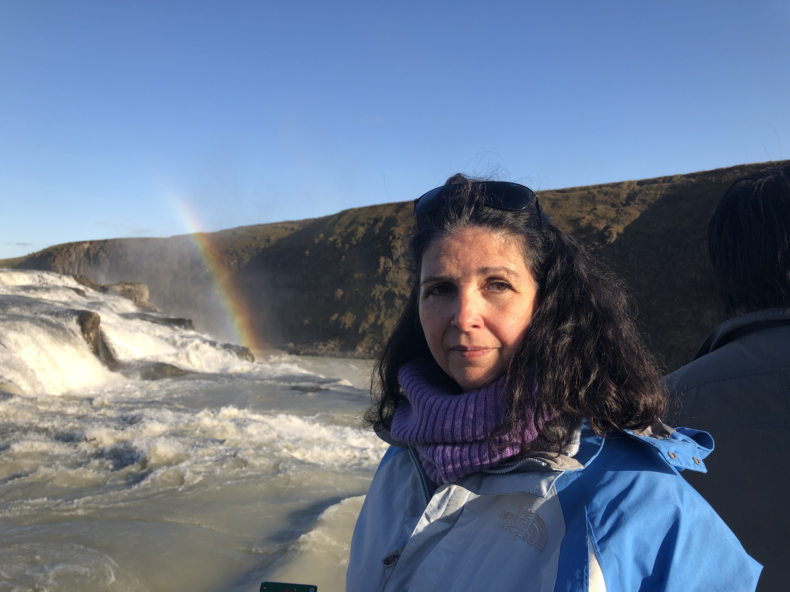

<!-- Main -->
<section id="one">
  

    <header class="major">
      <h2>Karina Suero</h2>
    </header>
    
    

      Karina was born in Spain and obtained a medical degree there, before moving to the US, where she raised three children, before resuming her life-long passion of helping others. 

      She is an experienced systemic family therapist, with an attachment based, trauma informed approach, and has worked 3+ years in a family based settings, with a variety of populations and different kinds of issues, including depression, attachment problems, defiant and aggressive behaviors, truancy and other issues. She has worked with single parent families  intact families and step and foster families.  She is also experienced in acculturation and rebalancing power in the context of multicultural families, including immigrant and families with deaf caregivers. 

  

</section>
