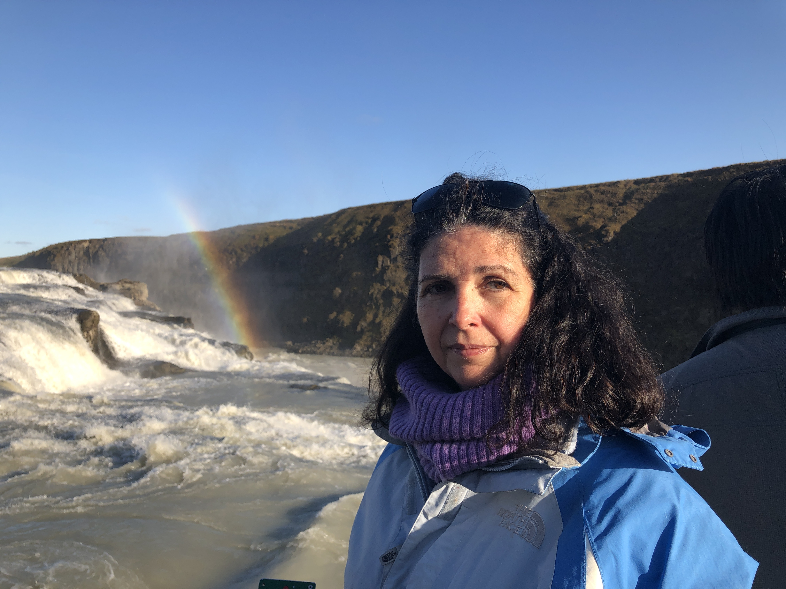

<!-- Main -->
<section id="one">
  

    <header class="major">
      <h2>Todos necesitamos ayuda en ocasiones. </h2>
    </header>
    
    

      
Soy una terapeuta educada  en la escuela sistémica, convencida de la importancia de las relaciones personales. He obtenido mi certificado en ESFT  (Eco Systemic Family Therapy ), orientada en tratamiento de trauma y con una base en attachment ( tipo de relación  afectiva). Es un tipo de terapia apropiada para niños, adolescentes, adultos , parejas, y unidades familiares. Me especializo en problemas de ansiedad, depresión, comportamientos agresivos y desafiantes, conflictos familiares y problemas en las relaciones interpersonales. 

Terapia es un proceso de descubrimiento acerca de uno mismo, de desarrollo  y maduración personal,  modificando de forma intencional  las  interactiones con uno mismo, con nuestras relaciones personales y con cómo funcionamos en el mundo, en el contexto de una relación que ofrece confidencialidad, honestidad, aceptación y apoyo.

En terapia, trabajaremos juntos para entender  qué papel desempeñas en tu situación, y sus consecuencias y  como enfrentarse a los desafíos a los  que la vida nos presenta,  tanto si es una persona buscando crecimiento y desarrollo personal, una pareja sometida a un cambio en su vida o una familia enfrentándose a una situación conflictiva. 

Entrar en opun proceso terapéutico, sea por primera  por enésima vez, puede parecer un proceso difícil y producir ansiedad. Podemos hacerlo juntos. 

  

</section>
<section id="two">
  

    <header class="major">
      <h2>La primera sesion:</h2>
    </header>
    

El objetivo de al primera sesión es conocernos: cuál es  el problema o problemas, a quien afecta, cuáles son las expectativas de resultados, cuál es el objetivo de la terapia. El proceso terapéutico es muy personal,  y distinto para cada persona o familia. La primera sesión es exploratoria, donde las preguntas son bienvenidas. Es una invitación a una forma de interaccionar distinta, tanto si es una sola persona o una familia. 

La primera sesión es una oportunidad para conocernos, para explorar lo que es el proceso terapéutico, las expectativas y obligaciones que requiere por ambas partes. Es también la ocasión de  intercambiar la información necesaria para tener encuentros regulares. tal como formas de contacto, frecuencia y coste de las sesiones y formas de pago. 

  

</section>
<section id="three">
  

    <header class="major">
      <h2>Karina:</h2>
    </header>
    
Karina es española. Completo los estudios de medicina en la Facultad Autónoma de Madrid. Poco después, se mudó a  los Estados Unidos, donde reside desde entonces, dedicándose a sus tres hijos. Karina retomó su pasión profesional y obtuvo la licencia de MFT ( marriage and family therapist).  Se ha especializado en terapia sistémica, con especial énfasis en vínculos afectivos y  terapia de trauma. Ha trabajo varios  años en un programs de terapias con las familias completas, ayudando con problemas diversos : depression, problemas de vínculo,  agresión, desafío, adopciones, problemas culturales, familias con miembros que padecen enfermedades médicas crónicas, entre otros. Karina ha experimentado la capacidad de adaptación y crecimiento de los individuos y las familias y lleva esa convicción a la relación terapéutica.

  

</section>